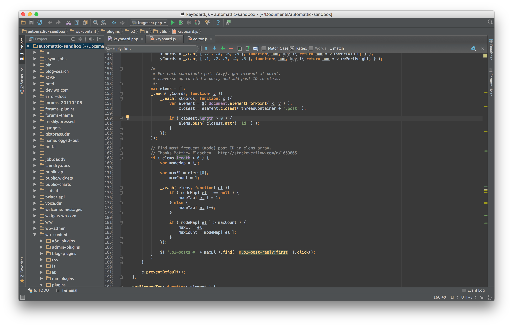

## Perceived Speed and Optimization

### Eric Binnion

### @ebinnion

---


# Eric Binnion

WordPress Core Contributor

Code Wrangler at Automattic

BA in Computer Science at MSU

@ebinnion

---

# Overview of this Session

- What is perceived speed?
- Examples
- Why is it so important?
- Implementation
- Questions?

---

# Perceived Speed
## **How quickly software** appears **to perform its task.**

---


---


---


---


---

# Which is Faster?

---


---

# Why?

---

> Perception is Reality
-- Lee Atwater

---


# Perceived Speed

> It's not about how fast your site is; it's about how fast your users think it is.
-- Kyle Peatt [^1]

[^1]: Quote from http://www.mobify.com/blog/beginners-guide-to-perceived-performance

---

## How do I Increase Perceived Speed?

---

# [fit] Optimistic Interfaces

## **A method of improving** perceived speed **of applications by** assuming **that interactions with the server will succeed.**

---


# [fit] Assume Success

- Emulate while waiting
- Makes use of:
  - AJAX
  - Backbone, React, etc.

---

# But, Check Success

- How do we check that a request succeeded?
- How do we display failures?
- How do we recover?
  - Do we automatically retry?

---

# Examples

- JetPack
- ROHO Sports / AppPresser
- O2

---


---


# Roho Sports

- AppPresser
- High School booster club
- Each sport had a separate site (multisite)
- Each site had to allow subscriptions

---

# [fit] Subscribe AJAX Example (PHP)

```php
add_action( 'wp_ajax_nopriv_register_device', 'register_device' );
add_action( 'wp_ajax_register_device', 'register_device' );
function register_device() {
	$blog_id = $_POST['blog_id'];
	$device  = $_POST['uuid'];

	$sport_devices = get_blog_option( $blog_id, 'registered_devices' );

	if ( is_array( $sport_devices ) ) {
		if ( ! in_array( $device, $sport_devices ) ) {
			$sport_devices[] = $device;
		}
	} else {
		$sport_devices = array( $device );
	}

	if ( ! update_blog_option( $blog_id, 'registered_devices', $sport_devices ) ) {
		wp_die( 'Registering device failed.' );
	}

	exit;
}
```

---

# [fit] Subscribe AJAX Example (JS)

```javascript
$( '.register-push' ).change(
	function( e ) {
		state = $( this ).is( ':checked' );
		target = $( this ).attr( 'data-site' );
		if ( 'undefined' !== typeof device && null !== device.uuid ) {
			var action = ( false == state ) ? 'deregister_device' : 'register_device';

			jQuery.post(
				apppCore.ajaxurl,
				{
					'action':  action,
					'uuid':    device.uuid,
					'blog_id': target
				},
				function( response ){
					console.log( response );
				}
			).fail( function( xhr, textStatus, errorThrown ) {

				// If the Ajax fails, then handle it
				alert( xhr.responseText );
			});
		}
	}
);
```

---


# O2 Trash Post

- slideUp Post (hide)
- Attempy to destroy/delete post
- If successful, remove post from DOM
- Else, slideDown post and show notice

---

# O2 Trash Post

```javascript
onTrash: function( event ) {
	event.preventDefault();
	event.stopPropagation();

	var postId = parseInt( o2.options.postId, 10 );

	if ( 0 == postId ) {

		// If currently on a list view, slide the post up then proceed with the destroy.
		this.$el.slideUp( this.destroyViewModel( this, postId ) );
	} else {

		// Check if there is a postTrashedFailed notification and remove if so
		o2.Notifications.notifications.findFirstAndDestroy( 'postTrashedFailed' );

		var trashString = ( 'page' == o2.options.viewType ) ? 'pageBeingTrashed' : 'postBeingTrashed';

		o2.Notifications.add( {
			text: o2.strings.trashString,
			url: false,
			type: 'postBeingTrashed',
			sticky: false,
			popup: false,
			dismissable: true
		} );

		this.destroyViewModel( this, postId );
	}
},
```

---

# O2 Trash Post

```javascript
destroyViewModel: function( view, postId ) {
view.model.destroy({
	wait: true,
	success: function( model, response ) {
		// Commented out for presentation
	},
	error: function( model, response ) {

		// Remove any actions menus that are currently open.
		view.closeOpenDisclosures();

		// Check if there is a postBeingTrashed notification and remove if so
		o2.Notifications.notifications.findFirstAndDestroy( 'postBeingTrashed' );

		var trashFailedString = ( 'page' == o2.options.viewType ) ? 'pageTrashedFailed' : 'postTrashedFailed';

		// If the destroy failed, show the post again.
		view.$el.slideDown();
		o2.Notifications.add( {
			text: o2.strings.trashFailedString,
			url: false,
			type: 'postTrashedFailed',
			sticky: false,
			popup: true,
			dismissable: true
		} );
	}
});
},
```

---


# [fit] O2 Trash Comment

- Change comment content
- If successful, do nothing
- Else, change comment content back

---

# O2 Trash Comment

```javascript
onTrash: function( event ) {
	event.preventDefault();
	event.stopImmediatePropagation();

	this.options.isSaving = true;
	this.options.isTrashedAction = true;

	o2.Events.dispatcher.trigger( 'notify-app.o2', { saveInProgress: true } );

	var updates = {
		isTrashed:      true,
		trashedSession: true
	};

	this.model.save( updates, { success: this.onSaveSuccess,error: this.onSaveError } );
},
````

---

#O2 Trash Comment

```javascript
onSaveError: function( model, xhr ) {
	o2.Events.dispatcher.trigger( 'notify-app.o2', { saveInProgress: false } );

	var responseText = '';
	var errorText = '';
	try {
		// See if the XHR responseText is actually a JSONified object
		var responseObject = $.parseJSON( xhr.responseText );
		if ( ( 'undefined' !== typeof responseObject.data.errorText ) ) {
			errorText = responseObject.data.errorText;
		}
	} catch ( e ) {
		// Not JSON - use the responseText directly
		// e.g. this occurs if you attempt to post the same comment twice - you get
		// a non JSON error back in the response
		errorText = xhr.responseText;
	}

	o2.Notifications.add( {
		model: model,
		type: 'error',
		text: errorText,
		sticky: true
	} );

	// Turn editing back on
	this.options.isSaving = false;
	this.options.isEditing = true;
	this.render();

	o2.Events.doAction( 'post-comment-save.o2' );
},
```

---

# [fit] Questions?

---

# Credits

Perceived Speed Photo Credit: [Loïc Lagarde](https://www.flickr.com/photos/32553078@N08/13937130316/) - cc

Instagram screenshots: [https://speakerdeck.com/mikeyk/secrets-to-lightning-fast-mobile-design](https://speakerdeck.com/mikeyk/secrets-to-lightning-fast-mobile-design)

^
Arguably one of the most important user interface metrics is speed – Or, more importantly, perceived speed. While much can be done to speed up a user interface by beefing up servers and minimizing the weight of resources, optimistically processing interactions can greatly increase the perceived speed of your website. This talk will discuss real-life use cases of optimistic programming in apps you use, as well as a few ways to use optimistic programming on your WordPress website.