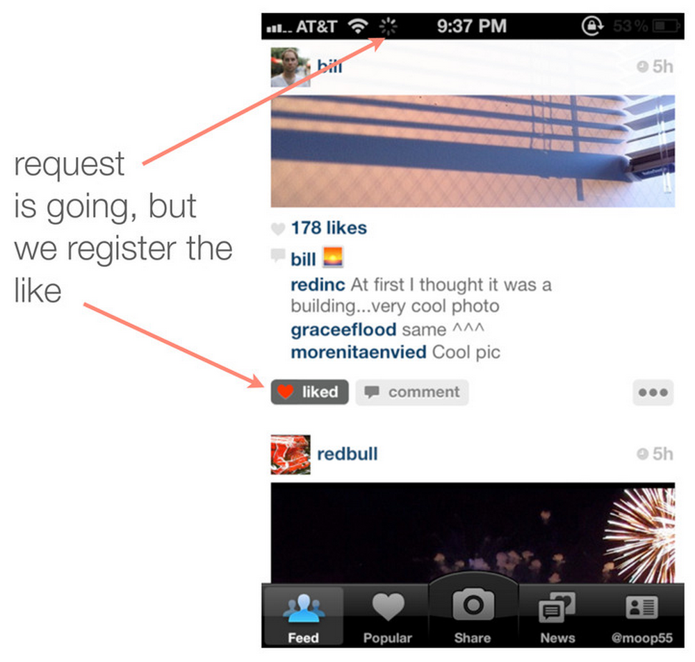

# Perceived Speed and Optimization

### Eric Binnion

### @ebinnion

---


# Eric Binnion

WordPress Core Contributor

Code Wrangler at Automattic

BA in Computer Science at MSU

@ebinnion

---

# Overview of this Session

- What is perceived speed?
- Why is it so important?
- Examples
- Implementation
- Questions?

---

# Perceived Speed
## **How quickly software** appears **to perform its task.**

---


---


---


---


---

# Which is Faster?

---


---

# Why?

---

> Perception is Reality
-- Lee Atwater

---


# Perceived Speed

> It's not about how fast your site is; it's about how fast your users think it is.
-- Kyle Peatt [^1]

[^1]: Quote from http://www.mobify.com/blog/beginners-guide-to-perceived-performance

---

# How do I Increase Perceived Speed?

---

# Optimistic Interfaces

## **A method of improving** perceived speed **of applications by** assuming **that interactions with the server will succeed.**

---

# Assume Success

```javascript
this.$el.slideUp( this.destroyViewModel( this, postId ) );
```

- Emulate while waiting
- Makes use of:
	- JavaScript
	- AJAX
	- Backbone, React, etc.

---

# Examples

- JetPack
- O2
- ROHO Sports / AppPresser

---


---


# Roho Sports

- AppPresser
- High School booster club
- Each sport had a separate site (multisite)
- Each site had to allow subscriptions

---


---


---

# Credits

Perceived Speed Photo Credit: [Loïc Lagarde](https://www.flickr.com/photos/32553078@N08/13937130316/) - cc

Instagram screenshots: [https://speakerdeck.com/mikeyk/secrets-to-lightning-fast-mobile-design](https://speakerdeck.com/mikeyk/secrets-to-lightning-fast-mobile-design)

---




^ Slides from Mike Krieger in 2011 presentation titled "Secrets to Lightning Fast Mobile Design"

---


---

Arguably one of the most important user interface metrics is speed – Or, more importantly, perceived speed. While much can be done to speed up a user interface by beefing up servers and minimizing the weight of resources, optimistically processing interactions can greatly increase the perceived speed of your website. This talk will discuss real-life use cases of optimistic programming in apps you use, as well as a few ways to use optimistic programming on your WordPress website.